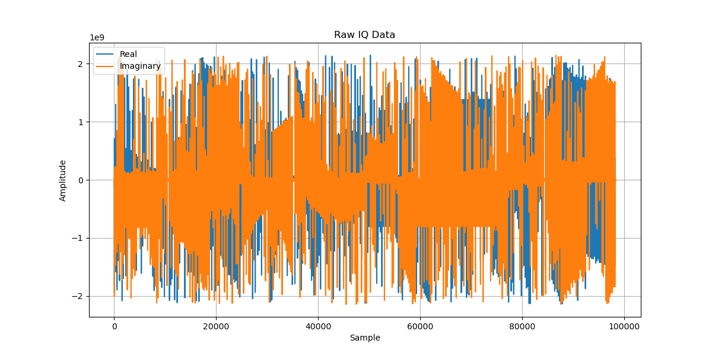
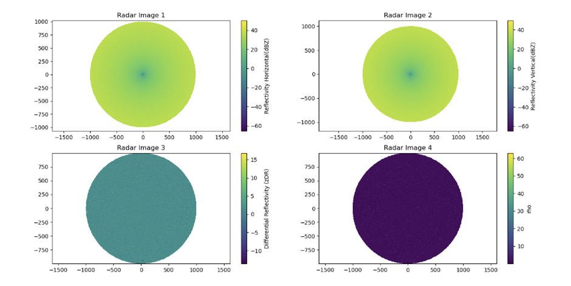

# IQ-Radar-Data-Processing

## Overview
Radar Data Processing for IQ Data Analysis project focuses on processing raw radar data received in IQ format, using tools such as Py-ART and PyRAD. This project is aimed at generating essential radar products including Reflectivity (Z), Differential Reflectivity (ZDR), Differential Propagation Phase (PHIDP), Mean Doppler Velocity (V), and Correlation Coefficient (RHOHV). The radar data utilized in this project is provided by the Indian Space Research Organization (ISRO), Bangalore, ensuring high-quality and reliable data sources.

## Key Features
1. IQ Data Processing: Utilizes Py-ART and PyRAD tools for processing raw radar data in IQ format.
2. Radar Product Generation: Generates key radar products essential for meteorological analysis:
2.1. Reflectivity (Z): Measures the intensity of reflected radar signals.
2.2. Differential Reflectivity (ZDR): Measures the differential attenuation of horizontally and vertically polarized radar signals.
2.3. Differential Propagation Phase (PHIDP): Measures the differential phase shift between horizontally and vertically polarized radar signals.
2.4. Mean Doppler Velocity (V): Measures the average velocity of scatterers relative to the radar.
2.5. Correlation Coefficient (RHOHV): Indicates the correlation between horizontally and vertically polarized radar signals.
3. Data Quality Assurance: Ensures the accuracy and reliability of radar products through rigorous validation and calibration processes.

4. Visualization and Analysis: Provides visualization tools to interpret and analyze radar products, aiding meteorologists and researchers in weather forecasting and analysis.

## Output

